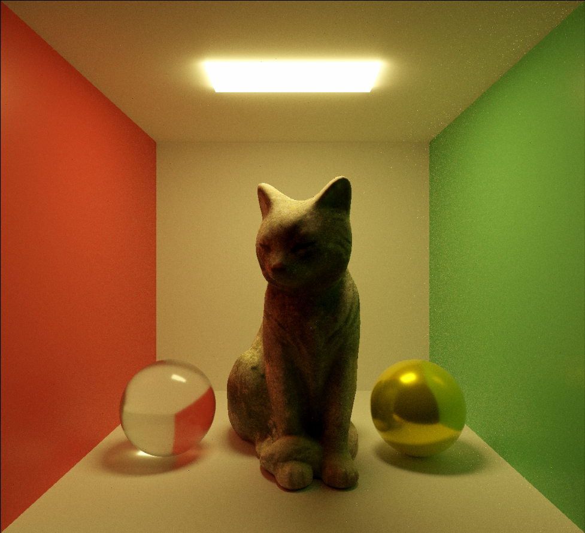

# Unity URP 路径追踪

## 使用方法
1. 在 URP Settings 中添加 PathTracing 作为 Render Feature 并启用
2. 创建一个挂载 PathTracingManager 脚本的空物体
3. 需要通过路径追踪渲染的物体挂载 PathTracingObject 组件，并作为 PathTracingManager 的子节点

ShaderToy 实现的简易版本：https://www.shadertoy.com/view/lcfGDs

## 已实现特性
1. 基于 Disney Principled BSDF 的着色模型
2. 参数化的统一材质（金属、清漆、玻璃等）
3. 针对不同 BSDF 波瓣的多重重要性采样
4. 对复杂网格的 BVH 加速结构优化
5. 部分纹理映射

## 待实现特性
1. 完全纹理映射
2. 体积路径追踪
……