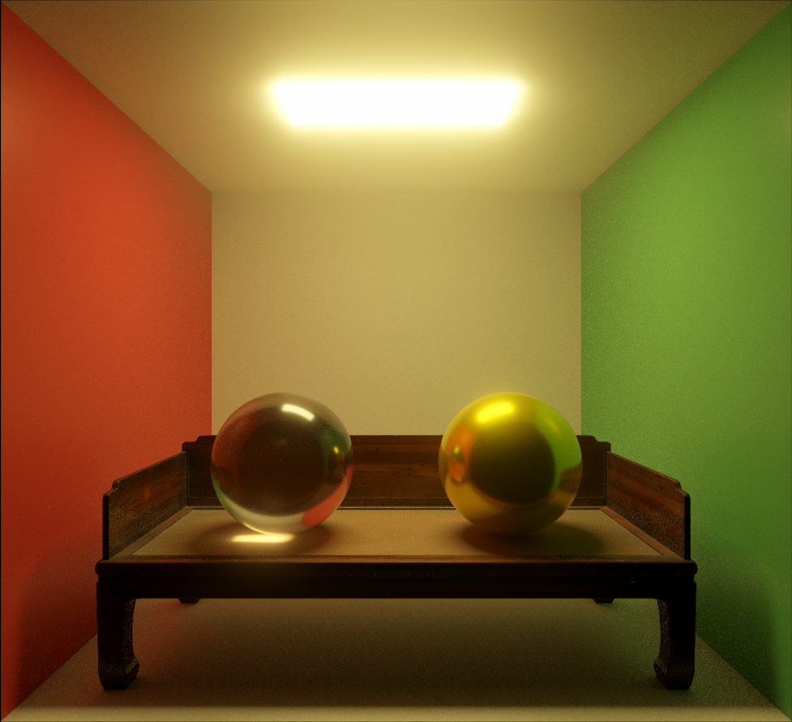
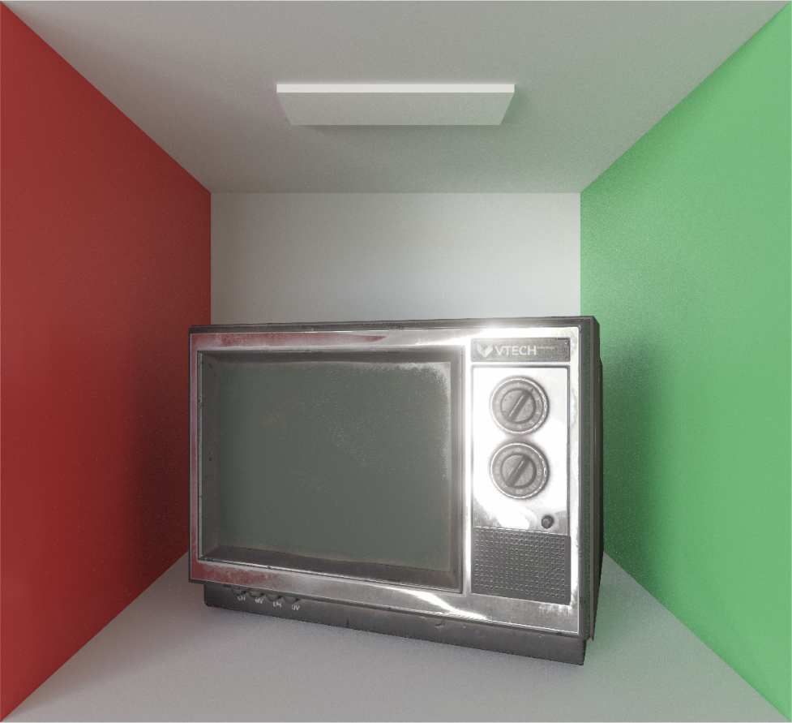
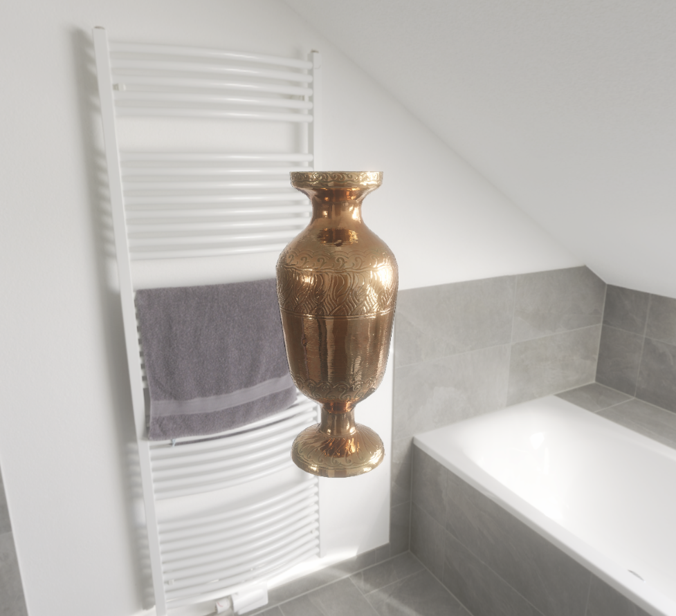
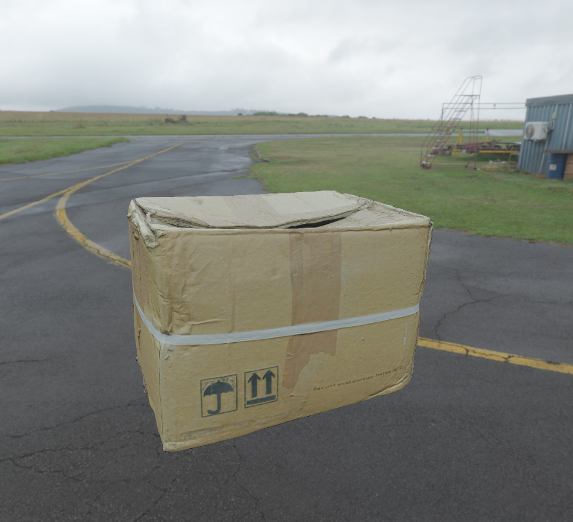

# Unity URP 路径追踪

  
  
  
  

## 使用方法
1. 在 URP Settings 中添加 PathTracing 作为 Render Feature 并启用
2. 创建一个挂载 PathTracingManager 脚本的空物体
3. 需要通过路径追踪渲染的物体挂载 PathTracingObject 组件，并作为 PathTracingManager 的子节点

ShaderToy 实现的简易版本：https://www.shadertoy.com/view/lcfGDs

## 已实现特性
1. 基于 Disney Principled BSDF 的着色模型
2. 参数化的统一材质（金属、清漆、玻璃等）与纹理映射（注：暂时只支持单个物体纹理）
3. 针对不同 BSDF 波瓣的多重重要性采样
4. 对复杂网格的 BVH 加速结构优化

## 待实现特性
1. NEE 采样
2. 分层与波动 BSDF
3. 体积路径追踪
4. 双向路径追踪
5. 路径重用和重要性重采样
……